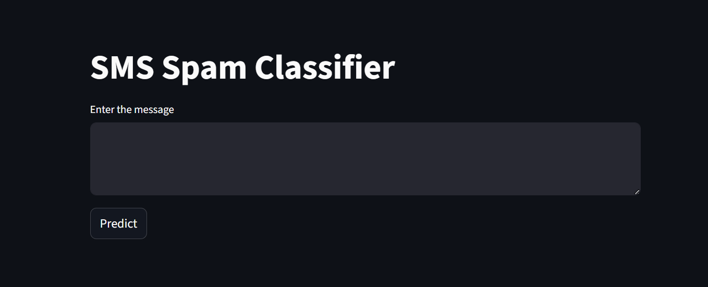
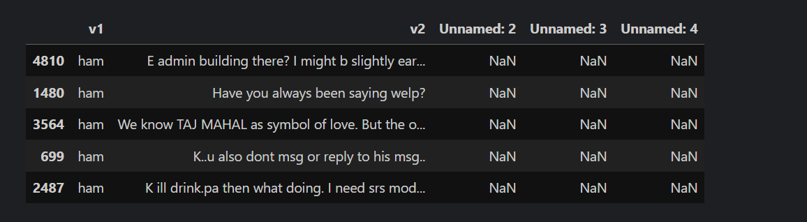
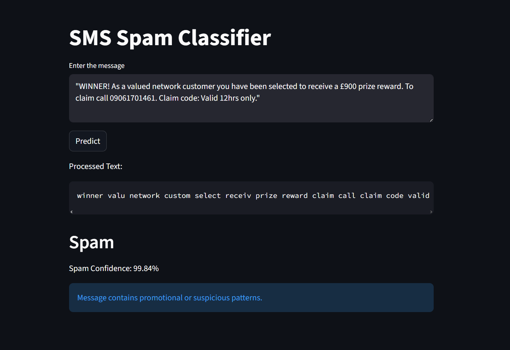
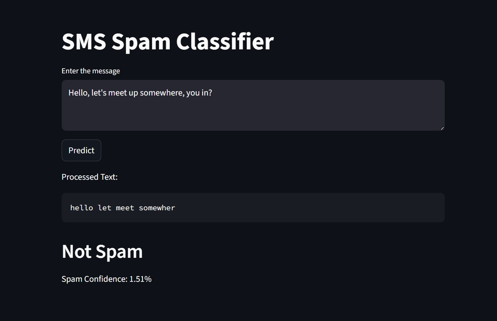

# SMS Spam Classifier

## Overview

This project is an end-to-end Machine Learning application that classifies SMS messages as Spam or Not Spam (Ham) using Natural Language Processing (NLP).

The system performs text preprocessing, feature extraction using TF-IDF Vectorization, and classification using the Multinomial Naive Bayes algorithm. A Streamlit web application enables real-time spam prediction.

---

## Problem Statement

Spam SMS messages are commonly used for advertising, phishing, and fraudulent activities. The goal of this project is to automatically detect and classify SMS messages into spam or legitimate categories using machine learning techniques.

---

## Project Workflow

Data Collection  
→ Data Cleaning  
→ Text Preprocessing  
→ Feature Engineering  
→ Model Training  
→ Model Evaluation  
→ Model Serialization  
→ Web Application Deployment

---

## Dataset

Dataset Used: SMS Spam Collection Dataset

The dataset contains labeled SMS messages categorized as:

- Spam
- Ham (Legitimate Messages)

Dataset Location:
data/spam.csv

---

## Text Preprocessing Steps

The following NLP preprocessing techniques were applied:

- Lowercasing text
- Tokenization
- Removal of special characters
- Stopword removal
- Stemming using Porter Stemmer

---

## Feature Engineering

TF-IDF Vectorization is used to convert text messages into numerical feature vectors suitable for machine learning algorithms.

---

## Model Used

Multinomial Naive Bayes was selected after model comparison due to strong performance in text classification tasks and better precision for spam detection.

---

## Model Evaluation Metrics

- Accuracy Score
- Precision Score
- Confusion Matrix Analysis

Precision is prioritized to minimize false spam classification.

---

## Deployment

The trained model and TF-IDF vectorizer were serialized using Pickle and deployed using Streamlit.

The application allows users to:

- Enter SMS text
- View processed message
- Predict Spam or Not Spam
- View spam confidence score

---

## Project Structure

```
sms-spam-classifier/
│
├── data/
│   └── spam.csv
│
├── model/
│   ├── model.pkl
│   └── vectorizer.pkl
│
├── notebooks/
│   └── model-training.ipynb
│
├── screenshots/
│   ├── app_interface.png
│   ├── dataset_preview.png
│   ├── spam_prediction.png
│   └── not_spam_prediction.png
│
├── app.py
├── requirements.txt
├── README.md
└── .gitignore
```

---

## Application Screenshots

### Application Interface


### Dataset Preview


### Spam Prediction


### Not Spam Prediction


---

## Installation and Setup

Clone Repository

git clone https://github.com/<your-username>/sms-spam-classifier.git

cd sms-spam-classifier

Install Dependencies

pip install -r requirements.txt

Run Application

streamlit run app.py

---

## Technologies Used

- Python
- Scikit-learn
- NLTK
- Pandas
- NumPy
- Streamlit
- Pickle
- Git & GitHub

---

## Future Improvements

- Cloud deployment
- REST API using FastAPI
- Deep Learning based NLP models
- Real-time SMS filtering integration

---

## Author

Your Name  
Machine Learning Enthusiast